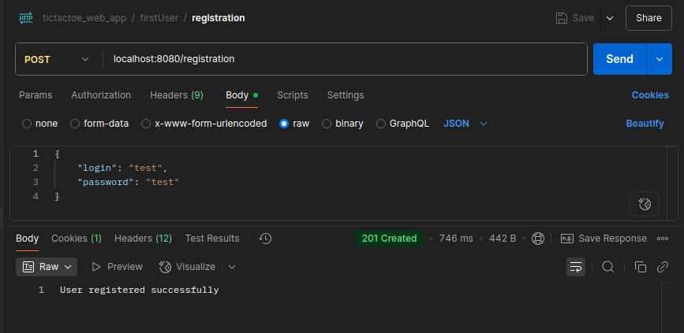

# tictactoe-web-application-v2_0

Обновленная версия проекта [tictactoe-web-application](https://github.com/dksss/tictactoe-web-application).

В этой версии добавлена базовая HTTP-аутентификация пользователей **(Basic Auth)** и поддержка **базы данных** для хранения информации об играх и пользователях. Контроллеры переписаны на **REST API** архитектуру. Добавлена возможность игры между двумя игроками.


## Общая информация

- Язык: Java
- Версия JDK: 21
- Система сборки: Gradle (Kotlin DSL)
- Фреймворки и библиотеки:
  - Spring Boot
  - Spring MVC
  - Spring Data
  - Spring Security
  - Hibernate


## Инструкция для запуска

1. Перейдите в корень проекта TicTacToe и выполните команду: ```sh run.sh```
  
    Эта команда поднимает Docker контейнеры с базой данных (PostgreSQL) и самим приложением через docker-compose. В файле *secret_data.env* находятся необходимые переменные окружения.

  **ИЛИ**

2. Соберите приложение, запустите выбранную базу данных и настройте параметры подключения в файле `src/main/resources/application.properties` согласно вашей конфигурации


## Описание эндпоинтов

#### Эндпоинты, доступные пользователям без авторизации

* `POST /registration` - для регистрации пользователя. Принимает *SignUpRequest*, в теле запроса (RequestBody) и возвращает подтверждение успешной регистрации.

    

* `POST /login` - для авторизации пользователя. Принимает логин и пароль в формате base64 (login:password) и возвращает UUID пользователя.

    


#### Эндпоинты для авторизованных пользователей

* `GET /user/{userId}` - получение информации о пользователе по UUID.

    

* `POST /game/bot` - создание новой игры с компьютером. Возвращает созданную игру.

    

* `POST /game/player` - создание новой игры с пользователем. Возвращает созданную игру.

* `POST /game/join/{gameId}` - присоединение пользователя к игре. Возвращает созданную другим пользователем игру.

* `PATCH /game/move/{gameId}` - ход игрока с пользователем или компьютером. Возвращает (обновленное в случае игры с ботом) игровое поле.

    

* `GET /game/all_games` - получение доступных текущих игр.

* `GET /game/{gameId}` - получение текущей игры.


## Описание изменений

#### Слой Datasource

- Класс-хранилище заменён двумя репозиториями для хранения информации о пользователях и играх, реализующими интерфейс `CrudRepository`.
- Для работы с базой данных используется ORM-фреймворк Hibernate.
- Классы в пакете `datasource` аннотированы с помощью JPA-аннотаций.


#### Слой Domain

- Добавлен сервис авторизации пользователей.
- Реализована логика игры между двумя игроками и обработка исключений.
- Класс `GameService` декомпозирован на вспомогательные классы с разделением зон ответственности.


#### DI

- Убраны все бины из предыдущей версии (бины теперь создаются через аннотации).
- Добавлен бин `PasswordEncoder` (реализация — `BCryptPasswordEncoder`) для хеширования паролей.
- Добавлен бин `AuthFilter` (наследник `GenericFilterBean`) для проверки авторизации пользователей.
- Добавлен бин `SecurityFilterChain` для фильтрации входящих запросов.


#### Слой Web

- Контроллер `GameController` переписан с использованием REST API.
- Добавлены контроллеры `AuthController` и `UserController`.
- Реализована централизованная обработка исключений через Spring AOP (`ExceptionControllerAdvice`).
- Добавлен фильтр `AuthFilter`.
- Добавлена модель `SignUpRequest` с полями: логин, пароль.